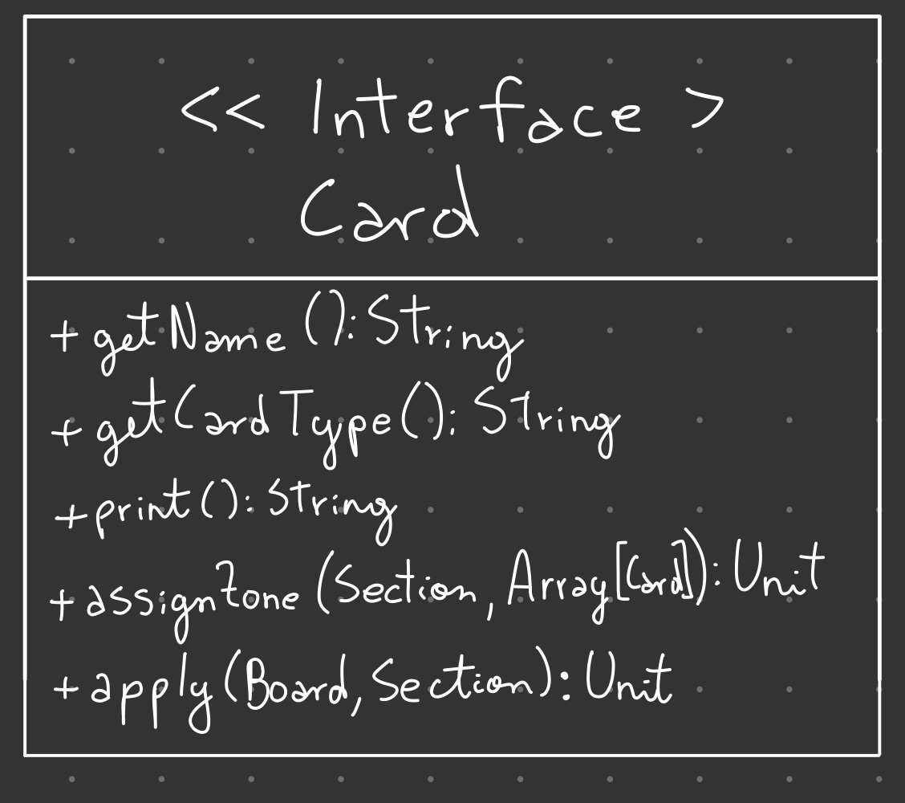
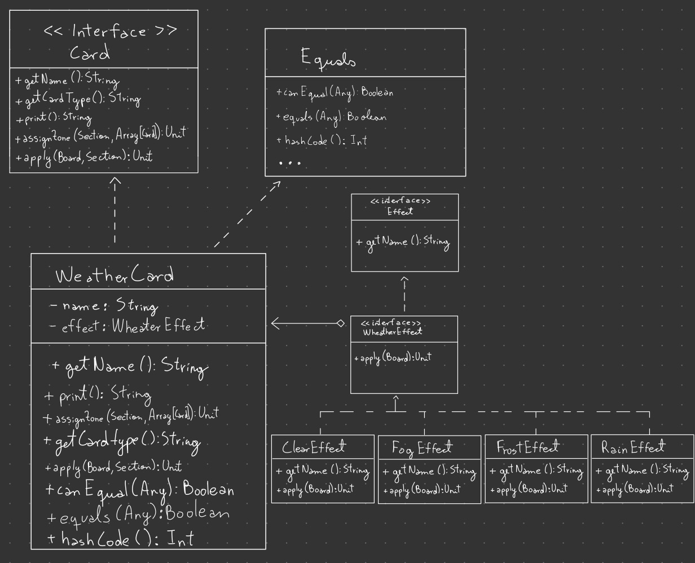
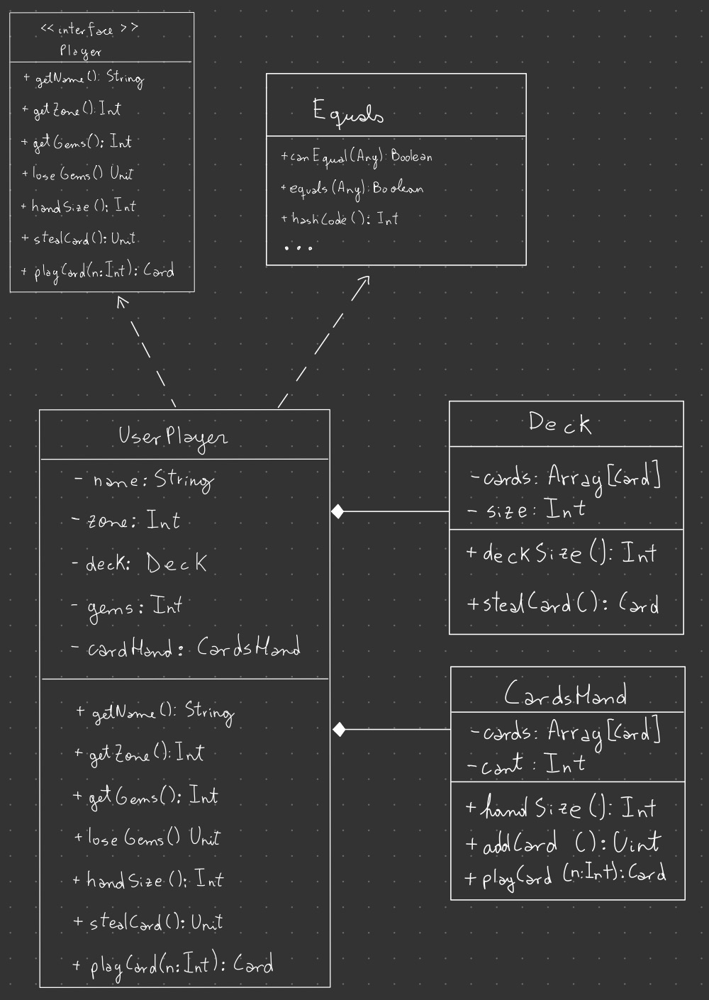
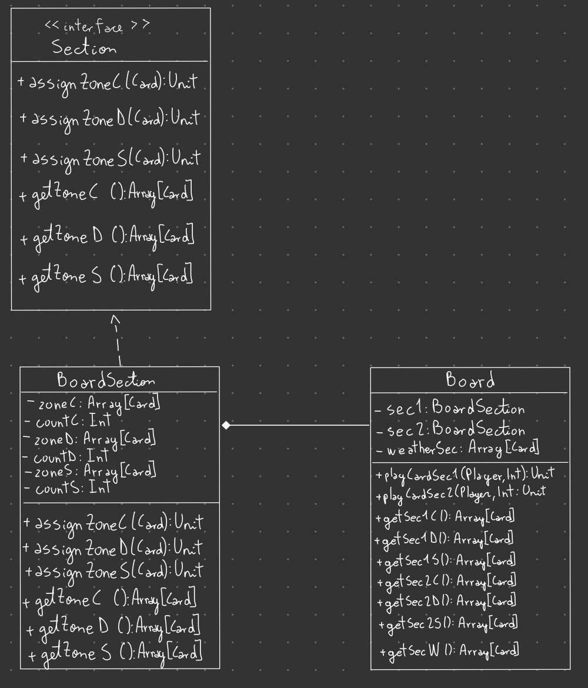
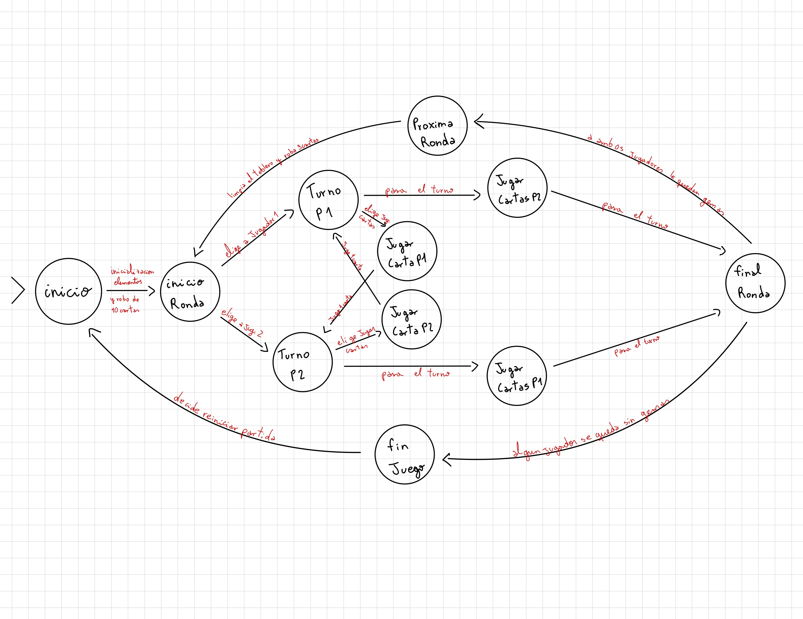

# Gwen't

This work is licensed under a
[Creative Commons Attribution 4.0 International License](http://creativecommons.org/licenses/by/4.0/)

Context
-------

Esta es una reimplementación de gwent desarrollado en Scala durante el curso de metodologías de diseño y programación de la Universidad de Chile con la finalidad de crear una app completa usando flutter y aprender dart y flutter en el proceso.

This project's goal is to create a (simplified) clone of the
[_Gwent_](https://www.playgwent.com/en)card game developed by [_CD PROJEKT RED_](https://cdprojektred.com/en/)

## Cartas
Se crea un Trait Card en el cual se especifica todo lo que debe tener todas las cartas. 
Este Trait va a ser implementado por las clases WeatherCard y UnitCard (abstract). Dentro de las funciones que deben 
tener las cartas se encuentra tener que saber a qué zona o fila asignarse mediante el método "assignZone"

### Interface de carta:
Todas las cartas comparten una interface (Trait "Card") en común que especifica los métodos que deben tener todas 
las cartas. Todas las cartas deben tener un nombre y un tipo (clima, cuerpo a cuerpo, a distancia o de 
asedio) por lo que deben tener un método que devuelva estos valores para poder utilizarlos, 
respectivamente estos métodos son getName y getCardType. Además, tienen un método assignZone que asigna donde debería 
quedar la carta cuando es jugada en el tablero.

Posteriormente se agregaron los métodos print y apply que respectivamente permiten entregar la informacion que se debe imprimir para 
cada carta y aplicar los efectos de las cartas

### Tipos de carta:

### WeatherCard:
Las cartas de clima son un tipo de carta especial, que se colocan en la zona de clima, 
para poder asegurar que se colocan en esa zona es que getCardType devuelve "Weather".

Estas cartas tendrán el poder de afectar el campo de batalla y brindar ventajas o desventajas a los jugadores, 
mediante los efectos que tengan.
Por ahora su implementación es de esta forma:

#### Efectos:
* ClearEffect: elimina todos los efectos climaticos actualmente en efecto
* FogEffect: o niebla impenetrable deja la fuerza de todas las unidades de combate a distancia en 1 y el resto quedan sin efectos.
* FrostEffect: o escarcha mordiente deja la fuerza de todas las unidades de combate cuerpo a cuerpo en 1 y el resto quedan sin efectos.
* RainEffect: o niebla mordiente deja la fuerza de todas las unidades de asedio en 1 y el resto quedan sin efectos.

### UnitCard:
La Clase abstracta UnitCard tiene 3 subclases, las cuales son CorpCard, SiegeCard y DistanceCard
las que respectivamente representan Unidades cuerpo a cuerpo, Unidades de asedio y Unidades a distancia.
Esta clase define los métodos getName y getStrength que devuelve el nombre y fuerza que debe tener una carta de unidad.

1. #### CorpCard: 
    Esta subclase de UnitCard representa las cartas cuerpo a cuerpo, hereda los métodos getName y getStrength
    de UnitCard y añade la implementación del método getCardType para que devuelva "CorpCard"
2. #### SiegeCard:
   Esta subclase de UnitCard representa las cartas cuerpo a cuerpo, hereda los métodos getName y getStrength
   de UnitCard y añade la implementación del método getCardType para que devuelva "SiegeCard"
3. #### DistanceCard:
   Esta subclase de UnitCard representa las cartas cuerpo a cuerpo, hereda los métodos getName y getStrength
   de UnitCard y añade la implementación del método getCardType para que devuelva "DistanceCard"

#### Efectos:
Para la implementación de los efectos se crearon 3 clases para las cartas de unidad (BondEffect, MoralEffect, NullEffect). 
* BondEffect: o vínculo estrecho, si ya existe una carta con el mismo nombre en la fila duplica la fuerza de esta incluyendose a si misma
* MoralEffect: o refuerzo moral, aumenta la fuerza de las cartas en su fila en 1, excepto a si misma
* NullEffect: es una implementación de null object para las cartas sin efecto

A su vez los efectos climaticos sobre las cartas se realizan mediante estados. ClearState, FogState, FrostState y RainState.

---

## Jugadores
La clase UserPlayer representa a los jugadores. Esta clase implementa los métodos del Trait Player 
y hace overriding de canEqual, equals y hashcode. Los jugadores del juego van a recibir tanto la 
posición en el tablero como su mazo de cartas. 

Para representar la mano de cartas y el mazo se hace uso de las clases CardsHand y Deck. 
Con estas clases se le entrega la responsabilidad de su funcionamiento a CardsHand y Deck,
liberando de su implementación a UserPlayer
### Deck
La representación del mazo de cartas se hace con un arreglo de cartas al que no se le pueden añadir más cartas, 
solo sacar cuando el jugador quiera robar una carta. Se da por entendido ue como el jugador va a recibir 
el mazo este ya contiene las cartas que le corresponden, por lo tanto, no se le pueden añadir más.

Como hasta ahora no se ha implementado que el juego le entregue un mazo, para simular que este haya
sido barajado a la hora de robar se va a sacar una carta aleatoria del mazo. De esta forma nos aseguramos
que el juego se comporte como si se hubiese barajado el mazo.

### CardsHand
A diferencia del mazo, la mano de cartas comienza sin cartas, se le pueden ir agregando cartas cuando el jugador 
robe cartas del mazo y perderá una carta cuando el jugador juegue una carta.

## Tablero de Juego
La clase Board representa el tablero de juego, esta clase tiene los métodos necesarios para que los jugadores jueguen sus cartas
y estás mediante double dispatch sepan en qué fila deban ser asignadas. Se crea un método para cada sección y que este
reciba al jugador, ya que conceptualmente creo que no es el tablero el que sabe la sección del jugador sino que debería ser una clase
de juego el que lo sepa y llame estos métodos.

Las secciones 1 y 2 se implementan mediante la clase BoardSection.

### BoardSection
La representación de las secciones se hace mediante la clase BoardSection que contiene las 3 filas de cada sección:
* Cuerpo a cuerpo
* Distancia
* Asedio
estas filas son arreglos con hasta 6 cartas, en donde cada uno recibe el tipo de carta correspondiente

## Controlador:
El siguiente esquema de estados resume los distintos estados en que puede encontrarse el GameController.

Los estados son los siguientes:
1. inicio (Start): En este primer estado se inicializan los jugadores, el tablero y luego cada jugador roba 10 cartas. 
De este estado se pasa a Inicio Ronda.
3. Inicio ronda (RoundInit): En este estado se decide cuál de los jugadores va a comenzar a jugar primero. Puede pasar a 
"Turno P1" o "Turno P2".
4. Turno P1: En este estado el jugador decide si jugar 1 carta o pasar el turno. Si el jugador decide jugar cartas 
pasa a "Jugar carta P1" y si elige pasar pasa al estado "Jugar Cartas P2". 
5. Jugar carta P1: En este estado el jugador decide cuál carta jugar. De este estado se pasa a "Turno P2"
6. Jugar cartas P1: En este estado el jugador puede jugar cuantas cartas quiera. De este estado se pasa a "Final de ronda"
7. Turno P2: En este estado el jugador decide si jugar 1 carta o pasar el turno. Si el jugador decide jugar cartas
   pasa a "Jugar carta P2" y si elige pasar pasa al estado "Jugar Cartas P1".
8. Jugar carta P2: En este estado el jugador decide cuál carta jugar. De este estado se pasa a "Turno P1"
9. Jugar cartas P2: En este estado el jugador puede jugar cuantas cartas quiera. De este estado se pasa a "Final de ronda"
10. Terminar ronda: En este estado se calculan los puntos de los jugadores y se restan las gemas correspondientes según quien perdio
o si hay empate. De este estado si alguno de los jugadores se quedo sin cartas se pasa a "Terminar juego" si no se pasa a "Proxima ronda"
11. Proxima ronda: En este estado se borra el tablero y roban 3 cartas cada jugador. De este estado se pasa a "Inicio de ronda"
12. Terminar juego: En este estado se evalua quien gano o si hubo empate. Si el jugador quiere puede reiniciar el juego volviendo a "Inicio"

Es importante notar que si el jugador no tiene cartas por jugar se pasa automáticamente su turno.

---
## Factories
Se implementan fábricas para la creación de las cartas al iniciar la partida (para crear los mazos). Cada Fabrica crea cartas 
de forma random eligiendo entre un arreglo de nombres, un entero (entre 0 y 20) que representa la fuerza de la carta y un efecto que se elige 
tambien de forma aleatoria.

---
## Vista
Es la clase encargada de los outputs e inputs del juego, permite que este se pueda jugar en la consola.
Dentro de sus funciones esta mostrar el tablero, la mano del jugador, preguntarle al jugador si quiere jugar cartas, cuál carta jugar, entre otras.

---
## UML Global

---
**The rest of the documentation is left for the users of this template to complete**

